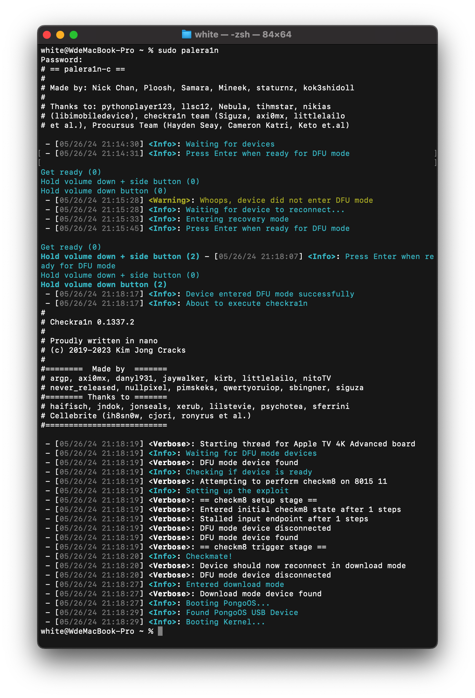
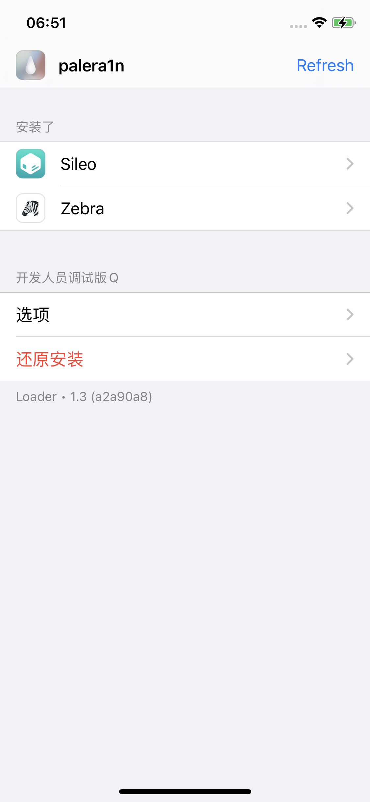

# iPhoneX + iOS 16.3.1 + palera1n分钟级越狱

## 0、环境及工具

+ Macos，M系
+ iPhoneX ，iOS16.3.1
+ palera1n，2.0.0

## 1、安装palera1n

terminal 执行 `sudo /bin/sh -c "$(curl -fsSL https://static.palera.in/scripts/install.sh)"`命令安装palera1n

## 2、执行越狱

用数据线连接iPhone，终端执行`sudo palera1n`按提示进行越狱。不过，有个坑是，M系的macOS用USB-C口一直有问题，换成USB-A就ok了，搭配个拓展坞。

按提示回车，然后按住音量减 + 电源4s，然后再提示松开电源键继续摁住音量减键8s，就进入DFU mode了。剩下的会自动注入等iPhone重启就行，整个过程不会超过2min。

## 3、安装Sileo、Zebra

进入home桌面点击palera1n（如果没有，稍等一会儿，等安装好出现图标即可），分别点击Sileo、Zebra进行安装即可

